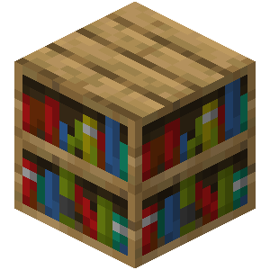

  

<h1 align="center">NBT Library</h1>

  A curated collection of hotbar files for Minecraft: Java Edition containing custom NBT items, kits, books, and more.

  <a href="https://kadthehunter.github.io/NBT-Library/">🌐 Visit the Website</a> • 
  <a href="https://discord.gg/cfq25qURfv">💬 Discord</a> • 
  <a href="https://github.com/KadTheHunter/NBT-Library/releases/latest/">📥 Download</a>

---

## 📥 Installation

### Prerequisites

- **Minecraft: Java Edition** (Bedrock not supported)
- **[Librarian Mod](https://modrinth.com/mod/librarian)** by videogamesm12 (highly recommended)
   - Allows pagination and displays titles/metadata for each hotbar
   - Without it, you can only use one hotbar at a time

### Steps

1. **Download** the latest release from [GitHub Releases](https://github.com/KadTheHunter/NBT-Library/releases/latest/)
2. **Extract** the `.zip` file
3. **Move** the `.nbt` files to `.minecraft/hotbars/`, creating the `hotbars/` folder if it doesn't exist.
   - You should see files like `hotbar.-1.nbt`, `hotbar.-2.nbt`, etc.
4. **Launch** Minecraft or run `/lb cache clear` in-game
5. **Open** the Hotbars tab in the Creative Inventory and navigate to the negative pages

### Without Librarian

1. Follow steps 1-3 above
2. Rename one `.nbt` file to `hotbar.nbt`
3. Move it to the root `.minecraft/` directory (⚠️ **This overwrites existing hotbars; Make a backup first!** ⚠️)
4. Launch Minecraft

> **Note:** Releases are strictly version-specific. A hotbar for 1.21.11 will not work on 1.21.4, and vice versa.

---

## 📚 Categories

The library is organized into 9 categories, each accessible as a separate hotbar page:

### -1. Utility / Abuse
Kits and items for convenience or exploitation.
- **Utility:** Building, Functional, Fun
- **Abuse:** All-In-One, Specific, Spawn Eggs, Spawners, Command Blocks

### -2. PvP
Combat-focused kits and items.
- **Kits:** OP/NBT, Meme/Theme, Related
- **Items:** Melee Weapons, Ranged Weapons, Armor

### -3. Potions
All potion types with custom effects.
- Offensive, Neutral, Defensive, Suicidal

### -4. Fireworks / Spawn Eggs
Custom explosions and unique mobs.
- **Fireworks:** Single, Launcher, Bundle/Box
- **Spawn Eggs:** Area Effect, Troll, Misc., Build, Bundle/Box

### -5. Misc. Functional
Functional items that don't fit elsewhere.
- **Kits:** Command Blocks, True Misc., Fun
- **Items:** Command Block, Display Entities, True Misc.

### -6. Lore / Non-Functional
Items focused on lore or aesthetics.
- **Lore:** S, A, B, C tiers
- **Non-Func.:** Kits, Items

### -7. Books
Player-written books.
- Fiction, Misc. The Heptameron, Utility

### -8. SongPlayer
Items for the [SongPlayer mod](https://modrinth.com/mod/songplayer).
- Kits/Playlists, Single Song Items

### -9. Txsla / MarioKartWii
Items by Txsla and MarioKartWii.

> Categories and subdivisions are subject to change at the curator's discretion.

---

## 🤝 Contributing

Contributions are welcome! Please use **only one** of the following methods to avoid duplicates:

### New Entries
1. **GitHub Issues:** Use the [Submit Entry](https://github.com/KadTheHunter/NBT-Library/issues/new/choose) template
2. **Discord:** Post in `#new-items` channel or DM `@kaddicus`

### Other Changes (Bugfixes, Recategorization, etc.)
1. **GitHub Issues:** Use the [Other Contribution](https://github.com/KadTheHunter/NBT-Library/issues/new/choose) template

**Discord:** https://discord.gg/cfq25qURfv

---

## 🔄 Updates

The NBT Library updates to new Minecraft versions as quickly as possible, though this may take a week or more due to NBT changes.

**Key differences from The Shulker Archives:**
- Items are **removed** if broken or outdated (not forced to update)
- Focus on **quality over quantity**
- Error-prone categories are "containerized" for easier maintenance

---

## 📖 About

The NBT Library is the successor to [The Shulker Archives](https://kadthehunter.github.io/ShulkerArchives/), created to address maintenance challenges:

- **Reduced scope:** Fewer total entries, easier to maintain
- **Curated quality:** "Slop" items filtered out alongside outdated content
- **Accessibility:** All items available in-game via Librarian, no need to leave your world or server

---

## ⚠️ Disclaimer

- **Version Specific:** Tied to specific Minecraft Java Edition versions
- **Creative Only:** Intended for Creative mode single/multiplayer
- **No Survival/Bedrock:** Not supported
- **Use at Your Own Risk:** Some items can cause lag, crashes, or corruption

---

## 📄 License

Released into the public domain via the [Unlicense](LICENSE).

---

**Links:** [Website](https://kadthehunter.github.io/NBT-Library/) • [Discord](https://discord.gg/cfq25qURfv) • [Releases](https://github.com/KadTheHunter/NBT-Library/releases)